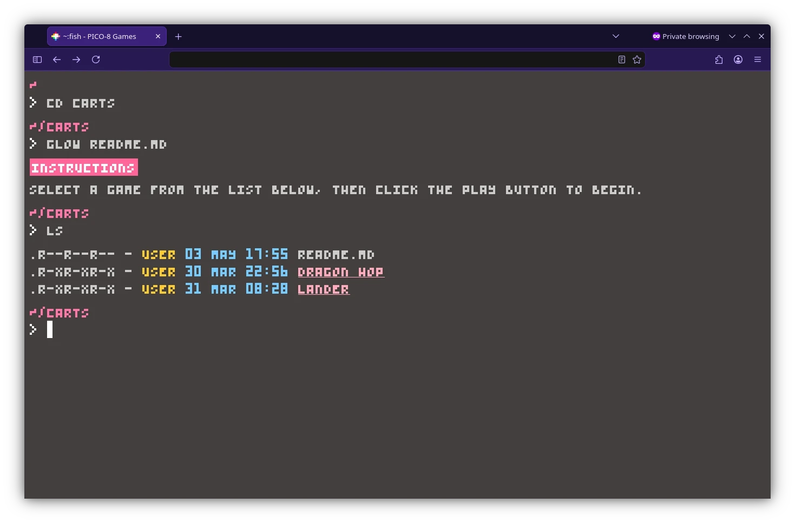

# PICO-8 Themed Webpage

A simple static webpage with a PICO-8 theme in a Fish Terminal design.

<table align="center">
  <tr>
    <td align="center">
      <br>
      <sub><em>Preview</em></sub>
    </td>
  </tr>
</table>

## How to add carts

1. You'll need the PICO-8 application to export a cartridge into HTML.
2. Load the cartridge.
3. Export the cartridge in HTML.
   ```
   EXPORT -F MYGAME.HTML
   ```
4. Place the exported files in the [carts](./public/carts/) folder. A sample is already provided that you can follow.
5. Edit the [pico-8-cart-list.js](./public/js/pico-8-cart-list.js) file and update the `CARTS` variable. A sample is also provided that you can follow.
6. Test by simply opening the [index.html](./public/index.html) in a browser then deploy the public folder to a platform of your choice.
